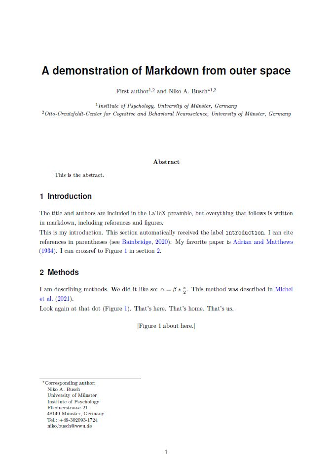

# busch-lab-md2latex
A workflow for converting markdown documents to LaTeX

## The problem
I have recently fallen out of love with writing academic documents in LaTeX. No offense, LaTeX produces PDFs with excellent typesetting, and its what-you-see-is-what-you-mean approach is much preferred over the typical word processor's what-you-see-is-what-you-get. However, I find the design of its markup language, where everything is backslash-command-curly_braces-something-curly_braces, increasingly annoying to type for my arthritic hands. Moreover, the user experience of most LaTeX editors just does not feel entirely up to date. 

I find it much more enjoyable to write documents with simple Markdown. Specifically, I enjoy writing with the [**Zettlr**](https://www.zettlr.com/) app, which includes useful features such as bibliography management with auto-suggestions in concert with [**Zotero**](https://www.zotero.org/). In principle, Zettlr even has a built-in tool for exporting .md files to PDF using the [Pandoc](https://pandoc.org/) document converter.

However, I often find that Zettlr's built-in export function is not sufficient for what I need. Specifically, sometimes I just need to produce a PDF with a specific format and layout. The same problem applies to using Pandoc directly because Pandoc likes to produce a PDF designed according to its own defaults and templates. So, rather than tweaking the options in the call to Pandoc, I just want Pandoc to convert my .md files to plain .tex, include the resulting .tex in my own LaTeX template, and then use pdflatex to produce the PDF.

## What you need
It took me a while to figure out how to do just that, and there might be easier ways to do it, but now this is what I came up with.

Things you need:
- Nikolay Yakimov's pandoc-crossref filter for the equivalent of Latex's \label{foo} and \ref{foo}: https://github.com/lierdakil/pandoc-crossref/releases
- A shell/batch script with the calls to Pandoc and pdflatex (md2tex.bat; included in this repo). Since I am  on MS Windows, this script has a .bat file extension and uses the Windows-appropriate symbol for commenting (`::`). However, the actual content of this script, i.e. the calls to pandoc and LaTeX are OS- independent, so it should be easy to adapt this script to Linux or Mac.
- A LaTeX template (article_template.tex; included in this repo). This template should contain the preamble with all packages and option for layout, typography etc. The main body simply has a \include{} statement, which loads the .tex file with all the content and a corresponding bibliography.

Also needed, not included in this repo, but if you are interested in this, you probably have it already:
- Tools for writing: Zettlr and Zotero
- I connect Zettlr to my Zotero Library as explained in [this video](https://www.youtube.com/watch?v=0egU3eLSSew).
- Pandoc
- A LaTeX distribution

## The workflow
- Write the Mardown document.
- For converting, open a terminal in the folder containing the manuscript and the content of this repo. On windows, open a file explorer (e.g. by pressing windows key + E) and navigate to the folder. Hold SHIFT and right-click, then select "Open PowerShell Window Here" from the context menu. In the terminal window, type: `.\md2tex.bat`. 
- Alternatively, just double-click the md2tex.bat file. This will run the script as well, but the terminal window will not stay open, making it impossible to check the output for errors. In other words, this works best once you are sure that everything is set up and runs without problems.
- If all goes well, this results in a PDF of your manuscript.

The md2tex.bat script does the following:
1. Use pandoc to convert the .md file(s) to LaTeX format and write to file `draft.tex`. This .tex file has no preamble of its own, it is simply the content of the markdown file, but with `#header`statements converted to `\section{header}`and citation commands converted to `\cite{}. 
2. Use pandoc to convert the .json bibliography to `mybib.bib`using Bibtex formatting. If you have not set up Zettlr with a .json bibliography, you can skip or adapt this step.
3. Use pdflatex (or alternatively xelatex) and bibtex to compile the template `article_template.tex`. Inside this template, we use `\include{draft.tex}`and `\bibliography{mybib}`to read in the files we just created with pandoc.

## The result
